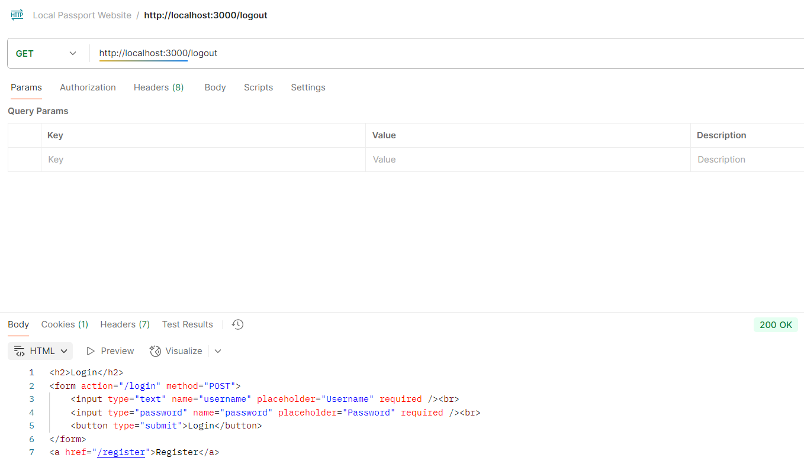

# Local Passport Website

This project demonstrates authentication using **Passport.js (LocalStrategy)**, **express-session**, and **MongoDB**, with an **EJS frontend**.  

Users can register, login, view a protected profile, and logout.  

All functions are tested using **Postman** and verified in **MongoDB**.

---

## Installation

1. Clone the repo:

   ```bash

   git clone https://github.com/minhchau-07/local_passport_website.git

   cd local_passport_website

2. Install dependencies: npm install

3. Run the server: node app.js

4. Server will run at: http://localhost:3000


## Routes and Tests
### 1. Register

POST /register

Body (x-www-form-urlencoded):

Key	       Value

username     admin

password	    12345

-Postman Result:


-MongoDB Check:


### 2. Login

POST /login

Body (x-www-form-urlencoded):

Key	       Value

username     admin

password	    12345

-Postman Result:


-Cookies Tab (connect.sid):


### 3. Profile (Protected)

GET /profile

Postman Result (authorized):


Postman Result (unauthorized, no cookie):


### 4. Logout

GET /logout

Postman Result:

